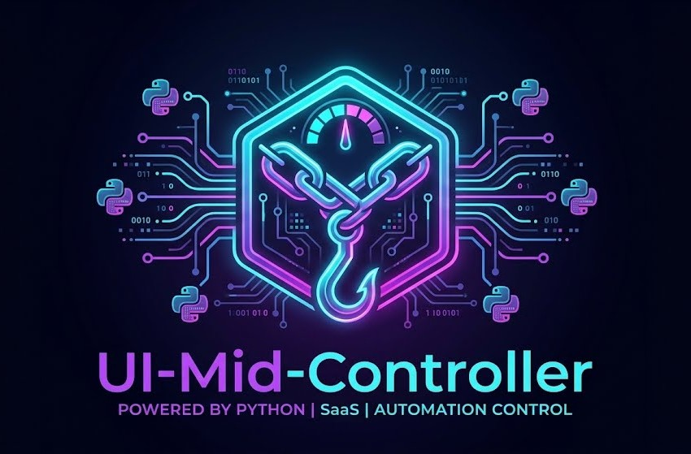

<div align="center">
  
# 🚀 UI-Mid-Controller

</div>


<div align="center">



**🐍 100% Pure Python Web Application**  
*Control webhooks with a cyberpunk-styled interface — No JavaScript, No Build Tools, No Complexity*

<br>

[](https://python.org)
[](https://streamlit.io)
[](https://docker.com)
[](https://n8n.io)
[](LICENSE)

**[GitHub](https://github.com/dynamicdev-official/ui-mid-controller)** · **[Documentation](#-quick-start)** · **[Issues](https://github.com/dynamicdev-official/ui-mid-controller/issues)**

</div>

---

## ⚡ What's This?

Think of **UI-Mid-Controller** as your **webhook command center** — a sleek, cyberpunk-styled dashboard built entirely in **Python** that lets you:

✅ **Trigger webhooks visually** — No curl commands, no API testing tools  
✅ **Monitor automation flows** — Real-time status from n8n, Make, or custom endpoints  
✅ **Manage AI agents** — Send prompts, get responses, display results instantly  
✅ **Chat interface** — Built-in message threading + file upload support  
✅ **Deploy anywhere** — Works on Linux, macOS, Windows + Docker  

**The catch?** Zero JavaScript. Zero npm. Zero build complexity. Just **Python all the way down.** 🐍

---

## 🎬 Why Build This?

<table>
<tr>
<td>

### Before UI-Mid-Controller
```bash
curl -X POST https://n8n.example.com/webhook \
  -H "Content-Type: application/json" \
  -d '{"message":"hello"}'

# Want UI? Learn React/Vue
# Want to deploy? npm install...
# Want to modify? TypeScript + webpack...
```

😤 **Clunky. Slow. Complex.**

</td>
<td>

### With UI-Mid-Controller
```python
streamlit run app.py

# Open browser → Click button → Done ✓
# Upload files? Deploy? Modify?
# All pure Python. No build steps.
```

😎 **Simple. Beautiful. Pure.**

</td>
</tr>
</table>

---

## 🖼️ Visual Overview

```
┌─────────────────────────────────────────────────────────────────┐
│              Browser (localhost:8502)                           │
│  ┌──────────────────────────────────────────────────────────┐   │
│  │  ╔════════════════════════════════════════════════════╗  │   │
│  │  ║       AI Chat   │    Monitor  │   Dashboard        ║  │   │
│  │  ╠════════════════════════════════════════════════════╣  │   │
│  │  ║  Message: "Analyze this data"                      ║  │   │
│  │  ║  [Upload File] [Send]                              ║  │   │
│  │  ║  Response:  Analysis complete                      ║  │   │
│  │  ╚════════════════════════════════════════════════════╝  │   │
│  └──────────────────────────────────────────────────────────┘   │
│                          │                                      │
│              ┌───────────▼───────────┐                          │
│              │   HTTP POST to n8n    │                          │
│              └───────────┬───────────┘                          │
└──────────────────────────┼──────────────────────────────────────┘
                           │
               ┌───────────▼───────────┐
               │  Webhook Platform     │
               │  (n8n / Make / etc)   │
               └───────────────────────┘
```

---

## 🚀 Quick Start

### Prerequisites
```bash
✅ Docker >= 20.x + Docker Compose >= 2.x
   (or Python 3.9+ for local development)
```

### 1️⃣ Clone & Configure

```bash
git clone https://github.com/dynamicdev-official/ui-mid-controller.git
cd ui-mid-controller

cp .env.example .env
nano .env  # Edit with your webhook URLs
```

```env
CHAT_WEBHOOK=https://n8n.yourdomain.com/webhook/chat
MONITOR_WEBHOOK=https://n8n.yourdomain.com/webhook/status
WEBHOOK_URL=https://n8n.yourdomain.com/webhook/custom
```

### 2️⃣ Launch

**With Docker (Recommended):**
```bash
docker compose up -d
# App ready at http://localhost:8502
```

**Or Local Python:**
```bash
pip install streamlit requests pandas pillow
streamlit run app.py --server.port 8502
```

### 3️⃣ Done! 🎉

Open `http://localhost:8502` and start controlling webhooks

---

## 🔗 Webhook Integration

### Request Format

```json
{
  "chatInput": "Hello, analyze my data",
  "sessionId": "dynamicdev_root",
  "file_data": "<base64-encoded>",
  "file_name": "report.pdf",
  "file_type": "application/pdf"
}
```

### Expected Response

```json
{
  "output": "Analysis complete: 15 records processed",
  "ai_file": "https://example.com/chart.png"
}
```

### Compatible Platforms

| Platform | Support |
|----------|---------|
| **n8n** | ✅ Native |
| **Make** | ✅ Works |
| **Zapier** | ✅ Works |
| **FastAPI** | ✅ Works |
| **Any HTTP** | ✅ Works |

---

## 🎨 Tech Stack

| Component | Tech |
|-----------|------|
| **Language** | Python 3.9+ |
| **UI Framework** | Streamlit |
| **HTTP** | requests |
| **Data** | pandas |
| **Container** | Docker + Docker Compose |

### Why Pure Python?

```python
# ✅ No JavaScript bundler complexity
# ✅ No npm dependency hell  
# ✅ No Node.js runtime needed
# ✅ No build/compile step
# ✅ Edit code → Refresh browser → Done

# Just Python. Fast. Clean. Beautiful.
```

---

## 📁 Project Structure

```
ui-mid-controller/
├── app.py                 # Main Streamlit application
├── docker-compose.yml     # Container orchestration
├── Dockerfile             # Image build definition
├── .env.example           # Environment template
├── requirements.txt       # Python dependencies
├── ui-mid-controller-logo.jpeg
└── README.md
```

---

## 🐳 Docker Setup

```yaml
services:
  ui-mid-controller:
    image: ui-mid-controller:latest
    ports:
      - "8502:8502"
    environment:
      - CHAT_WEBHOOK=https://n8n.example.com/webhook/chat
    volumes:
      - ./:/app
    networks:
      - dynamicdev-net
```

**Port Mapping:**
- `8502` → UI-Mid-Controller (this)
- `5678` → n8n (optional)
- `8501` → Other Streamlit apps (optional)

---

## 🔒 Security

✅ Environment-based secrets (no hardcoded URLs)  
✅ HTTPS-only production webhooks  
✅ Request timeouts (30s max)  
✅ Non-root Docker container  
✅ Input validation & sanitization  

```bash
# Never commit .env file
echo ".env" >> .gitignore
```

---

## 🛠️ Development

### Local Setup

```bash
python -m venv venv
source venv/bin/activate
pip install -r requirements.txt
streamlit run app.py --server.port 8502
```

### Hot Reload

Streamlit auto-reloads on code changes. Just save and refresh.

### Extending Features

Add new functionality in pure Python:

```python
import streamlit as st
import requests

if st.button("🚀 Launch"):
    response = requests.post(WEBHOOK_URL, json={"action": "launch"})
    st.success(f"✅ {response.json()}")
```

No JSX. No TypeScript. No build step. Just Python.

---

## 🎯 Use Cases

### 🤖 AI Agent Controller
UI → Send message → n8n → LLM → Display response

### 📊 Automation Dashboard
UI → Monitor button → Check status → Show metrics

### 🔄 File Processing
UI → Upload file → n8n process → Return results

### 💬 ChatBot Interface
UI → Message + file → Backend → Chat history

---

## 🤝 Contributing

1. [Open an issue](https://github.com/dynamicdev-official/ui-mid-controller/issues)
2. [Fork & clone](https://github.com/dynamicdev-official/ui-mid-controller/fork)
3. Create feature branch: `git checkout -b feature/amazing`
4. Commit: `git commit -m 'Add amazing feature'`
5. Push: `git push origin feature/amazing`
6. Open PR

---

## 📝 License

MIT License — See [LICENSE](LICENSE) for details

---

## 🌟 Share This Project

<div align="center">

### Social Media Templates

```
🐍 Just discovered UI-Mid-Controller — 100% Pure Python webhook dashboard!

No JavaScript. No npm. No build complexity.
Just beautiful Python code controlling automation workflows.

Perfect for n8n, Make, Zapier integrations.

#Python #Streamlit #Automation #OpenSource #n8n #NoCode
```

</div>

---

## 👥 Credits

<div align="center">

```
╔═══════════════════════════════════════════════╗
║  Built by dynamicdev_official                 ║
║                                               ║
║  github.com/dynamicdev-official               ║
║  support@dynamicdev.asia                      ║
║  james.dynamicdev@gmail.com                   ║
║                                               ║
║  Made with in Bangkok, Thailand               ║
╚═══════════════════════════════════════════════╝
```

**Powered by:**
- [Streamlit](https://streamlit.io) — Python web UI
- [n8n](https://n8n.io) — Workflow automation
- [Python](https://python.org) — Best language 🐍

</div>

---

<div align="center">

### 📢 Connect With Us

[](https://github.com/dynamicdev-official)
[](mailto:support@dynamicdev.asia)
[](https://dynamicdev.asia)

<br>

**Made with 🐍 Python | Deployed with 🐳 Docker | Powered by ⚡ Automation**


</div>
